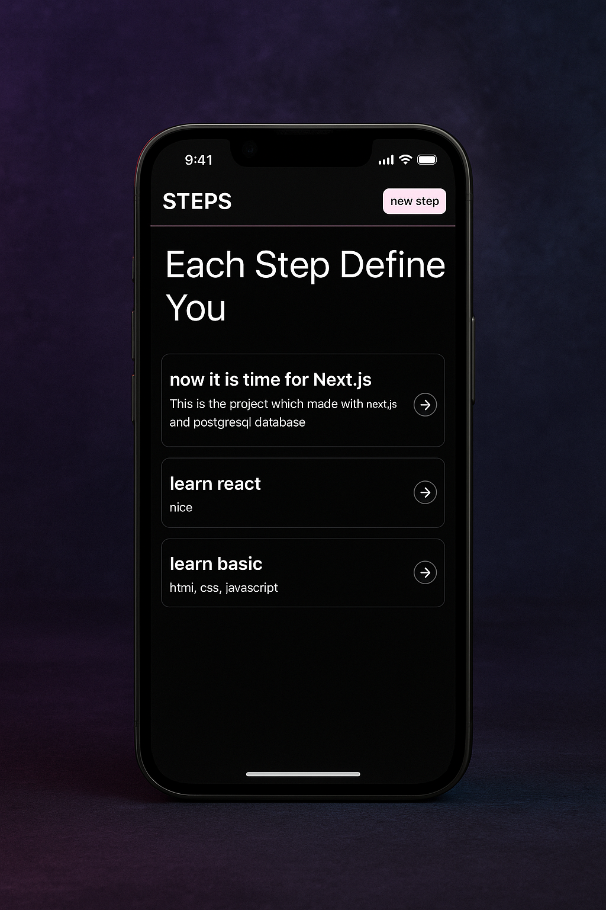

# 🪜 Steps

Steps is a full-stack CRUD application built with **Next.js** and **PostgreSQL**, designed to manage and track... well, anything that requires steps 😄 (tasks, goals, projects). It's a simple but powerful demo of modern web development with server-side rendering, API routes, and database integration.

---

---

## ⚙️ Tech Stack

- **Framework:** [Next.js](https://nextjs.org/)
- **Database:** [PostgreSQL](https://www.postgresql.org/)
- **ORM / DB Tooling:** Drizzle
- **Styling:** Tailwind

---

## 🚀 Features

- Create, Read, Update, Delete "steps"
- Responsive UI
- Server-side rendering (SSR)
- Fully connected to PostgreSQL for persistent data
- Error handling and form validation

---

## 📚 What I Learned

This is my first project with Next.js. So, I learned

- How to structure the folder and file.
- How server-side rendering works in Next.js
- Connecting and querying a PostgreSQL database
- Setting up environment variables for DB connections
